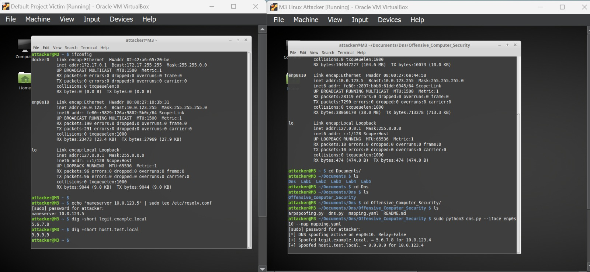

# Offensive_Computer_Security
# DNS Spoofer Tool

A simple DNS spoofing and relay tool written in Python using Scapy. It listens for DNS queries on a specified network interface and either forges responses for configured hostnames or relays queries to an upstream DNS server.

---

## Features

* **Targeted Spoofing**: Only spoof domains defined in a YAML mapping file (supports exact names and `*.suffix` wildcards).
* **Relay Mode**: Forward all other queries to a real upstream DNS server and return their answers.
* **Lightweight**: Pure Python with Scapy; no external DNS libraries required.
* **Clean Shutdown**: Handles `Ctrl-C` for a graceful exit.

---

## Requirements

* Python 3.6+
* `scapy`
* `PyYAML`

Install dependencies:

```bash
sudo apt update
sudo apt install python3-pip python3-setuptools libyaml-dev
sudo pip3 install scapy[complete] pyyaml
```

---

## Installation

1. Clone this repository (or copy `dns.py` and `mapping.yml`).
2. Make  the script is executable:

   ```bash
   chmod +x dns.py
   ```

---

## Usage

```bash
sudo python3 dns.py -i <interface> -m <mapping-file> [--relay] [--upstream <server>]
```

* `-i`, `--iface` : Network interface to listen on (e.g., `eth0`).
* `-m`, `--map`   : Path to the YAML mapping file.
* `--relay`      : Relay unmatched queries to the upstream server.
* `--upstream`   : IP address of upstream DNS (default: `8.8.8.8`).

### Example

Given a `mapping.yml`:

```yaml
legit.example.local: 5.6.7.8
*.test.local:      9.9.9.9
```

Run the spoofer on interface `enp0s3` in spoof-only mode:

```bash
sudo python3 dns.py -i enp0s3 -m mapping.yml
```

**On the victim** (configured to use the attacker as DNS):

```bash
$ dig +short legit.example.local
5.6.7.8

$ dig +short foo.test.local
9.9.9.9

$ dig +short other.com
# no reply (unless --relay is used)
```



To enable relay mode so that other domains still resolve correctly:

```bash
sudo python3 dns.py -i enp0s3 -m mapping.yml --relay --upstream 10.0.0.1
```

Then:

```bash
$ dig +short other.com
93.184.216.34   # real answer from upstream
```

---

## How It Works

1. **Sniff**: Captures UDP port 53 packets on the chosen interface.
2. **Match**: Checks each query name against the mapping (exact + `*.suffix`).
3. **Spoof**: Crafts a DNS reply (A record, TTL=300s) with the forged IP.
4. **Relay**: If enabled and no match, forwards raw DNS queries to upstream and returns their answers.

Internals:

* Uses Scapy to build and send packets (handles checksums).
* Runs in a daemon thread for easy shutdown.
* Validates mapping file for correct IP syntax.


